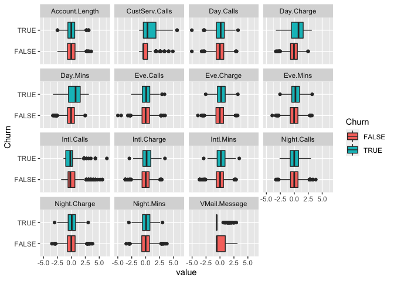
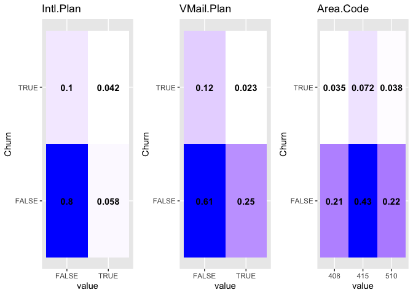
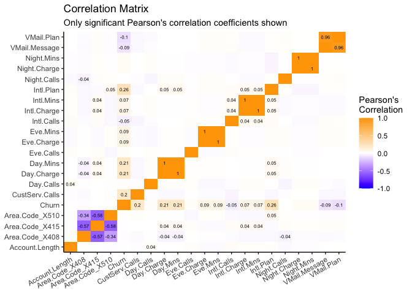
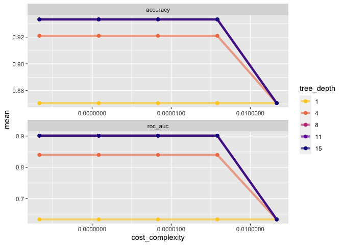
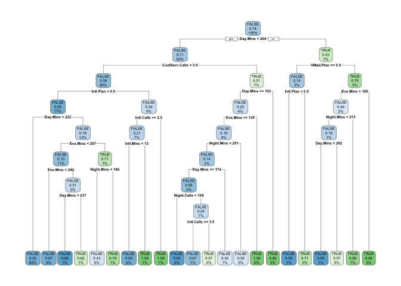
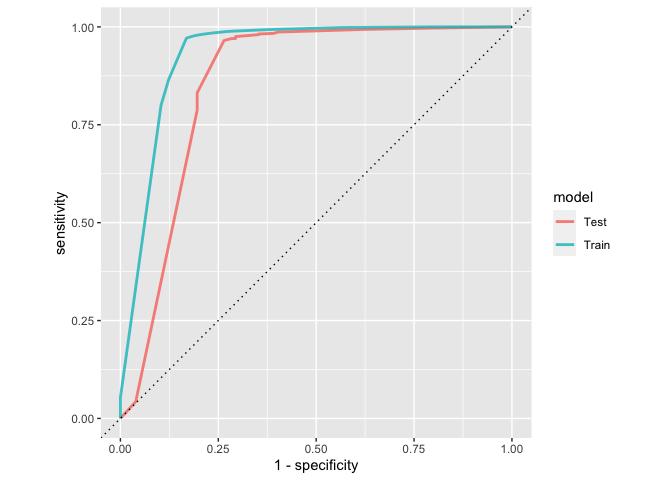
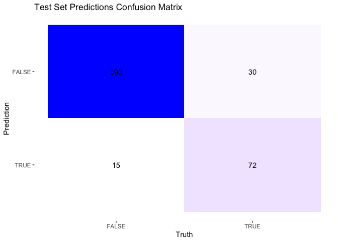
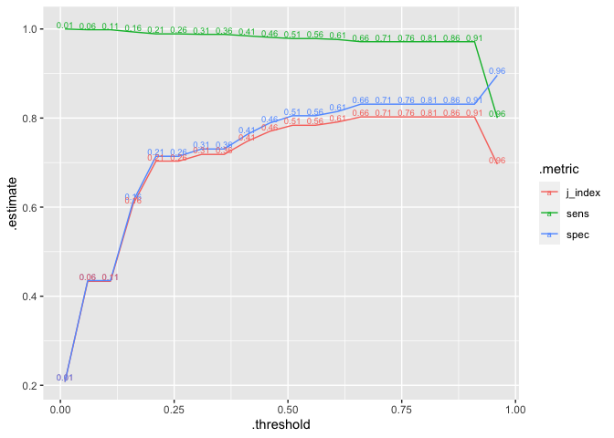

IE 298 DS\&A Case 3: Classification
================
Lino Licuanan
11/1/2020

## Data Preparation

``` r
suppressPackageStartupMessages({
  library(tidyverse)
  library(tidymodels)
  library(glue)
  library(cowplot)
  library(rpart.plot)
  library(probably)
  library(openxlsx)
})

churn.dt <- 
  read_csv("ChurnTrain.csv") %>% 
  mutate(
    Churn = as.factor(if_else(!is.na(Churn), str_detect(Churn, "^T"), NA)),
    `Area Code` = as.factor(`Area Code`),
    `Intl Plan` = case_when(
      `Intl Plan` == "yes" ~ TRUE,
      `Intl Plan` == "no"  ~ FALSE,
      TRUE                 ~ NA
    ),
    `VMail Plan` = case_when(
      `VMail Plan` == "yes" ~ TRUE,
      `VMail Plan` == "no"  ~ FALSE,
      TRUE                  ~ NA
    )
  ) %>% 
  rename_all(~make.names(.))
```

    ## Parsed with column specification:
    ## cols(
    ##   `Account Length` = col_double(),
    ##   `Area Code` = col_double(),
    ##   `Intl Plan` = col_character(),
    ##   `VMail Plan` = col_character(),
    ##   `VMail Message` = col_double(),
    ##   `Day Mins` = col_double(),
    ##   `Day Calls` = col_double(),
    ##   `Day Charge` = col_double(),
    ##   `Eve Mins` = col_double(),
    ##   `Eve Calls` = col_double(),
    ##   `Eve Charge` = col_double(),
    ##   `Night Mins` = col_double(),
    ##   `Night Calls` = col_double(),
    ##   `Night Charge` = col_double(),
    ##   `Intl Mins` = col_double(),
    ##   `Intl Calls` = col_double(),
    ##   `Intl Charge` = col_double(),
    ##   `CustServ Calls` = col_double(),
    ##   Churn = col_character()
    ## )

## Exploratory Analysis

``` r
churn.dt %>% 
  summary()
```

    ##  Account.Length  Area.Code  Intl.Plan       VMail.Plan      VMail.Message   
    ##  Min.   :  1.0   408: 704   Mode :logical   Mode :logical   Min.   : 0.000  
    ##  1st Qu.: 74.0   415:1411   FALSE:2552      FALSE:2058      1st Qu.: 0.000  
    ##  Median :100.0   510: 718   TRUE :281       TRUE :775       Median : 0.000  
    ##  Mean   :100.8                                              Mean   : 8.036  
    ##  3rd Qu.:127.0                                              3rd Qu.:19.000  
    ##  Max.   :243.0                                              Max.   :51.000  
    ##     Day.Mins       Day.Calls       Day.Charge       Eve.Mins    
    ##  Min.   :  0.0   Min.   :  0.0   Min.   : 0.00   Min.   :  0.0  
    ##  1st Qu.:143.8   1st Qu.: 87.0   1st Qu.:24.45   1st Qu.:165.8  
    ##  Median :179.5   Median :101.0   Median :30.52   Median :201.4  
    ##  Mean   :180.0   Mean   :100.5   Mean   :30.60   Mean   :200.9  
    ##  3rd Qu.:216.6   3rd Qu.:114.0   3rd Qu.:36.82   3rd Qu.:235.5  
    ##  Max.   :350.8   Max.   :165.0   Max.   :59.64   Max.   :363.7  
    ##    Eve.Calls       Eve.Charge      Night.Mins     Night.Calls   
    ##  Min.   :  0.0   Min.   : 0.00   Min.   : 23.2   Min.   : 36.0  
    ##  1st Qu.: 87.0   1st Qu.:14.09   1st Qu.:166.7   1st Qu.: 87.0  
    ##  Median :100.0   Median :17.12   Median :201.4   Median :100.0  
    ##  Mean   :100.1   Mean   :17.07   Mean   :201.0   Mean   :100.2  
    ##  3rd Qu.:114.0   3rd Qu.:20.02   3rd Qu.:235.8   3rd Qu.:113.0  
    ##  Max.   :170.0   Max.   :30.91   Max.   :395.0   Max.   :175.0  
    ##   Night.Charge      Intl.Mins       Intl.Calls      Intl.Charge   
    ##  Min.   : 1.040   Min.   : 0.00   Min.   : 0.000   Min.   :0.000  
    ##  1st Qu.: 7.500   1st Qu.: 8.50   1st Qu.: 3.000   1st Qu.:2.300  
    ##  Median : 9.060   Median :10.30   Median : 4.000   Median :2.780  
    ##  Mean   : 9.046   Mean   :10.24   Mean   : 4.457   Mean   :2.765  
    ##  3rd Qu.:10.610   3rd Qu.:12.10   3rd Qu.: 6.000   3rd Qu.:3.270  
    ##  Max.   :17.770   Max.   :20.00   Max.   :20.000   Max.   :5.400  
    ##  CustServ.Calls    Churn     
    ##  Min.   :0.000   FALSE:2423  
    ##  1st Qu.:1.000   TRUE : 410  
    ##  Median :1.000               
    ##  Mean   :1.563               
    ##  3rd Qu.:2.000               
    ##  Max.   :9.000

``` r
continuous_vars.ls <- churn.dt %>% 
  select_if(is.numeric) %>% 
  colnames()

categorical_vars.ls <- churn.dt %>% 
  select(where(is.logical) | where(is.factor), -Churn) %>% 
  colnames()

churn.dt %>% 
  select(Churn, all_of(continuous_vars.ls)) %>% 
  gather(key = "variable", value = "value", -Churn) %>% 
  group_by(variable) %>% 
  mutate(value = scale(value)) %>% 
  ungroup() %>% 
  ggplot(aes(x = value, y = Churn, fill = Churn)) +
  geom_boxplot() +
  facet_wrap(~ variable)
```



``` r
categorical_summary.tbl <- 
  churn.dt %>% 
  select(Churn, all_of(categorical_vars.ls)) %>% 
  gather(key = "variable", value = "value", -Churn) %>% 
  group_by(variable, Churn, value) %>% 
  summarise(count = n()) %>% 
  ungroup() %>% 
  group_by(variable) %>% 
  mutate(share = signif(count / sum(count), 2)) %>% 
  ungroup()
```

    ## Warning: attributes are not identical across measure variables;
    ## they will be dropped

    ## `summarise()` regrouping output by 'variable', 'Churn' (override with `.groups` argument)

``` r
for (var in categorical_vars.ls) {
  categorical_summary.tbl %>% 
    filter(variable == var) %>% 
    ggplot(aes(x = value, y = Churn, fill = share)) +
    geom_tile() +
    scale_fill_gradient(low = "white", high = "blue") +
    geom_text(aes(label = share), vjust = .5, fontface  = "bold", alpha = 1) +
    theme(legend.position = "none") +
    ggtitle(glue("{var}")) -> plot
  
  assign(paste0(str_replace_all(var, " ", ""), ".plt"), plot)
}

plot_grid(Intl.Plan.plt, VMail.Plan.plt, Area.Code.plt, nrow = 1)
```



``` r
cors <- function(df) {
  M <- Hmisc::rcorr(as.matrix(df)) 
  Mdf <- map(M, ~data.frame(.x)) 
  return(Mdf) 
}

formatted_cors <- function(df, sig_level = 1) {
  cors(df) %>%
    map(~rownames_to_column(.x, var="measure1")) %>%
    map(~pivot_longer(.x, -measure1, "measure2")) %>% 
    bind_rows(.id = "id") %>%
    pivot_wider(names_from = id, values_from = value) %>%
    mutate(
      sig_p    = ifelse(P < sig_level, T, F), 
      p_if_sig = ifelse(P < sig_level, P, NA), 
      r_if_sig = ifelse(P < sig_level, r, NA)
    ) 
}
```

``` r
churn_recipe <- churn.dt %>% 
  recipe(~ .)

formatted_cors(
  churn_recipe %>% 
    step_dummy(Area.Code, one_hot = TRUE) %>% 
    prep(training = churn.dt) %>% 
    juice() %>% 
    mutate_if(is.logical, as.integer) %>% 
    mutate_if(is.factor, as.integer) %>% 
    select(
      # -contains("Charge"), 
      where(is.numeric)
    ),
  sig_level = .05
) %>%
  ggplot(aes(measure1, measure2, fill=r, label=round(r_if_sig, 2))) +
  geom_tile() + 
  labs(x = NULL, y = NULL, fill = "Pearson's\nCorrelation", 
       title = "Correlation Matrix", 
       subtitle = "Only significant Pearson's correlation coefficients shown") + 
  scale_fill_gradient2(
    mid = "white",
    low = "blue",
    high = "orange", 
    limits = c(-1, 1)
  ) +
  geom_text(size = 2) +
  theme_classic() +
  scale_x_discrete(expand = c(0, 0)) + 
  scale_y_discrete(expand = c(0, 0)) +
  theme(
    axis.text.x = element_text(angle = 30, hjust = 1)
  )
```

    ## Warning: Removed 373 rows containing missing values (geom_text).



There are some promising predictors in the dataset. We make the decision
though to take out all “Charge” variables as we are fairly certain it is
tied with “Mins” variables. This makes sense as calls become more
expensive the longer they are. Another set of highly correlated
variables are “VMail.Plan” and “VMail.Message”. We retain only the
former.

Weeding out these highly correlated predictors reduces the risk of
estimation error when we start modeling the data.

``` r
selected_vars.ls <- 
  churn.dt %>% 
  select(-contains("Charge"), -VMail.Message, -Churn) %>% 
  colnames()
```

## Decision Tree Model

The dataset is split into the training set and the test set, comprising
75% and 25% of all datapoints, respectively.

We tune two hyperparameters, `cost_complexity` and `tree_depth` for the
decision tree to obtain the most optimal model. We perform tuning via
cross validation on 10 folds of the training set.

``` r
set.seed(456)

churn_split.dt <- 
  initial_split(
    churn.dt %>% 
      select(Churn, all_of(selected_vars.ls)) %>% 
      recipe(~ .) %>% 
      step_dummy(Area.Code) %>% 
      prep(training = churn.dt) %>% 
      juice(), 
    strata = Churn
  )
churn_train.dt <- training(churn_split.dt)
churn_test.dt  <- testing(churn_split.dt)

churn_recipe <- 
  churn_train.dt %>% 
  recipe(Churn ~ .)

decision_tree <- 
  decision_tree(
    cost_complexity = tune(),
    tree_depth      = tune()
  ) %>%
  set_engine("rpart") %>%
  set_mode("classification")

tree_grid <- 
  grid_regular(
    cost_complexity(),
    tree_depth(),
    levels = 5
  )

churn_folds.dt <- vfold_cv(churn_train.dt)

decision_tree_workflow <- 
  workflow() %>%
  add_recipe(churn_recipe) %>%
  add_model(decision_tree) 

decision_tree_tuning <-
  decision_tree_workflow %>% 
  tune_grid(
    resamples = churn_folds.dt,
    grid      = tree_grid
  )

decision_tree_tuning %>%
  collect_metrics() %>%
  mutate(tree_depth = factor(tree_depth)) %>%
  ggplot(aes(cost_complexity, mean, color = tree_depth)) +
  geom_line(size = 1.5, alpha = 0.6) +
  geom_point(size = 2) +
  facet_wrap(~ .metric, scales = "free", nrow = 2) +
  scale_x_log10(labels = scales::label_number()) +
  scale_color_viridis_d(option = "plasma", begin = .9, end = 0)
```



The best performing model’s hyperparameters is described below:

``` r
decision_tree_tuning %>% select_best("roc_auc")
```

    ## # A tibble: 1 x 3
    ##   cost_complexity tree_depth .config
    ##             <dbl>      <int> <chr>  
    ## 1    0.0000000001          8 Model11

``` r
final_decision_tree_workflow <-
  decision_tree_workflow %>% 
  finalize_workflow(
    decision_tree_tuning %>% select_best("roc_auc")
  ) 

decision_tree_fit_train <- 
  final_decision_tree_workflow %>% 
  fit(churn_train.dt) %>% 
  pull_workflow_fit()

rpart.plot(decision_tree_fit_train$fit, roundint = FALSE)
```



### Model Evaluation

``` r
decision_tree_pred_train.dt <- 
  predict(decision_tree_fit_train, churn_train.dt) %>% 
  bind_cols(predict(decision_tree_fit_train, churn_train.dt, type = "prob")) %>% 
  bind_cols(churn_train.dt %>% select(Churn))

decision_tree_pred_train.dt %>% 
  roc_curve(Churn, .pred_FALSE) %>% 
  mutate(model = "Train") -> decision_tree_roc_train.dt

decision_tree_fit_test <- 
  final_decision_tree_workflow %>%
  last_fit(churn_split.dt) 

decision_tree_fit_test %>%
  collect_predictions() %>% 
  roc_curve(Churn, .pred_FALSE) %>% 
  mutate(model = "Test") -> decision_tree_roc_test.dt

bind_rows(
  decision_tree_roc_train.dt, 
  decision_tree_roc_test.dt
) %>%  
  ggplot(aes(x = 1 - specificity, y = sensitivity, col = model)) + 
  geom_path(lwd = 1, alpha = 0.8) +
  geom_abline(lty = 3) + 
  coord_equal()
```



``` r
decision_tree_fit_test %>%
  collect_predictions() %>% 
  conf_mat(Churn, .pred_class) %>% 
  autoplot(type = "heatmap") +
  scale_fill_gradient(
    low  = "white",
    high = "blue"
  ) +  
  ggtitle("Test Set Predictions Confusion Matrix")
```

    ## Scale for 'fill' is already present. Adding another scale for 'fill', which
    ## will replace the existing scale.



### Probability Threshold Tuning

We further optimize the model by choosing a probability threshold that
maximizes true positives while keeping overall classification accuracy
at a high clip.

``` r
thresholds <- seq(0.01, 1.0, by = 0.05)

decision_tree_pred_train.dt %>% 
  threshold_perf(Churn, .pred_FALSE, thresholds) %>% 
  arrange(desc(.estimate), desc(.threshold)) %>% 
  filter(.metric != "distance") %>% 
  ggplot(aes(x = .threshold, y = .estimate, color = .metric)) +
  geom_line() +
  geom_text(aes(label = .threshold), nudge_y = 0.01, size = 2.5)
```



The above plot shows that if `p(NOT CHURNED) ≤ 91%` then we can maximize
true churns at low cost to overall performance.

``` r
decision_tree_fit_test %>%
  collect_predictions() %>%
  # decision_tree_pred_train.dt %>%
  mutate(.pred_class = as.factor(if_else(.pred_TRUE >= .09, TRUE, FALSE))) %>% 
  conf_mat(Churn, .pred_class) %>% 
  autoplot(type = "heatmap") +
  scale_fill_gradient(
    low  = "white",
    high = "blue"
  ) +  
  ggtitle("Test Set Predictions Confusion Matrix")
```

    ## Scale for 'fill' is already present. Adding another scale for 'fill', which
    ## will replace the existing scale.


## Submission Preparation

``` r
churn_submission.dt <-
  read_csv("ChurnTest.csv") %>% 
  rename(
    `Intl Plan` = `Int'l Plan`,
    `Churn`     = `Churn?`
  ) %>% 
  mutate(
    `Area Code` = as.factor(`Area Code`),
    `Intl Plan` = case_when(
      `Intl Plan` == "yes" ~ TRUE,
      `Intl Plan` == "no"  ~ FALSE,
      TRUE                 ~ NA
    ),
    `VMail Plan` = case_when(
      `VMail Plan` == "yes" ~ TRUE,
      `VMail Plan` == "no"  ~ FALSE,
      TRUE                  ~ NA
    )
  ) %>% 
  rename_all(~make.names(.))
```

    ## Parsed with column specification:
    ## cols(
    ##   `Account Length` = col_double(),
    ##   `Area Code` = col_double(),
    ##   `Int'l Plan` = col_character(),
    ##   `VMail Plan` = col_character(),
    ##   `VMail Message` = col_double(),
    ##   `Day Mins` = col_double(),
    ##   `Day Calls` = col_double(),
    ##   `Day Charge` = col_double(),
    ##   `Eve Mins` = col_double(),
    ##   `Eve Calls` = col_double(),
    ##   `Eve Charge` = col_double(),
    ##   `Night Mins` = col_double(),
    ##   `Night Calls` = col_double(),
    ##   `Night Charge` = col_double(),
    ##   `Intl Mins` = col_double(),
    ##   `Intl Calls` = col_double(),
    ##   `Intl Charge` = col_double(),
    ##   `CustServ Calls` = col_double(),
    ##   `Churn?` = col_character()
    ## )

``` r
churn_submission_processed.dt <- 
  churn_submission.dt %>% 
  select(all_of(selected_vars.ls)) %>% 
  recipe(~ .) %>% 
  step_dummy(Area.Code) %>% 
  prep(training = churn_submission.dt) %>% 
  juice()

decision_tree_pred_submission.dt <- 
  decision_tree_fit_train %>% 
  predict(churn_submission_processed.dt, type = "prob") %>% 
  transmute(
    Predictions = as.factor(if_else(.pred_TRUE >= .09, TRUE, FALSE))
  ) %>% 
  bind_cols(read_csv("ChurnTest.csv"))
```

    ## Parsed with column specification:
    ## cols(
    ##   `Account Length` = col_double(),
    ##   `Area Code` = col_double(),
    ##   `Int'l Plan` = col_character(),
    ##   `VMail Plan` = col_character(),
    ##   `VMail Message` = col_double(),
    ##   `Day Mins` = col_double(),
    ##   `Day Calls` = col_double(),
    ##   `Day Charge` = col_double(),
    ##   `Eve Mins` = col_double(),
    ##   `Eve Calls` = col_double(),
    ##   `Eve Charge` = col_double(),
    ##   `Night Mins` = col_double(),
    ##   `Night Calls` = col_double(),
    ##   `Night Charge` = col_double(),
    ##   `Intl Mins` = col_double(),
    ##   `Intl Calls` = col_double(),
    ##   `Intl Charge` = col_double(),
    ##   `CustServ Calls` = col_double(),
    ##   `Churn?` = col_character()
    ## )

``` r
write.xlsx(
  decision_tree_pred_submission.dt, 
  file = "IE 298 Case 3 - Licuanan.xlsx"
)
```

## Train vs. Submission

``` r
churn.dt %>% 
  group_by(Churn) %>% 
  count() %>% 
  ungroup() %>% 
  mutate(share = n / sum(n))
```

    ## # A tibble: 2 x 3
    ##   Churn     n share
    ##   <fct> <int> <dbl>
    ## 1 FALSE  2423 0.855
    ## 2 TRUE    410 0.145

``` r
decision_tree_pred_submission.dt %>% 
  group_by(Predictions) %>% 
  count() %>% 
  ungroup() %>% 
  mutate(share = n / sum(n))
```

    ## # A tibble: 2 x 3
    ##   Predictions     n share
    ##   <fct>       <int> <dbl>
    ## 1 FALSE         424 0.848
    ## 2 TRUE           76 0.152

The ratios appear to be similar, lending credibility to the model.

<br></br>
