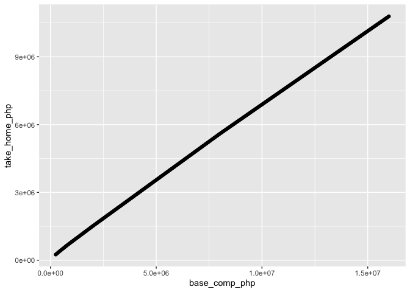

PH Tax Burden
================
Lino Licuanan
1/16/2021

### Just simple proof that the tax burden from TRAIN Law is linear.

``` r
suppressPackageStartupMessages({
  library(tidyverse)
  library(googlesheets4)  
})

gs4_auth()
```

    ## Suitable tokens found in the cache, associated with these emails:
    ##   * linolicuanan@gmail.com
    ##   * lmlicuanan14@gmail.com
    ##   * lmlicuanan@up.edu.ph
    ## The first will be used.

    ## Using an auto-discovered, cached token.
    ## To suppress this message, modify your code or options to clearly consent to the use of a cached token.
    ## See gargle's "Non-interactive auth" vignette for more details:
    ## https://gargle.r-lib.org/articles/non-interactive-auth.html

    ## The googlesheets4 package is using a cached token for linolicuanan@gmail.com.

``` r
tax_schedule.dt <- sheets_read(
  "1opVXXj3fUHkRBizN5-NrnfNQQPe5076fFYocLk36948", 
  sheet = "Tax Schedule"
) %>%
  mutate(max = as.numeric(max))
```

    ## Warning: `sheets_read()` is deprecated as of googlesheets4 0.2.0.
    ## Please use `range_read()` instead.
    ## This warning is displayed once every 8 hours.
    ## Call `lifecycle::last_warnings()` to see where this warning was generated.

    ## Auto-refreshing stale OAuth token.

    ## Reading from "071120"

    ## Range "'Tax Schedule'"

``` r
print(tax_schedule.dt)
```

    ## # A tibble: 6 x 4
    ##       min     max lump_sum variable
    ##     <dbl>   <dbl>    <dbl>    <dbl>
    ## 1       0  250000        0     0   
    ## 2  250000  400000        0     0.2 
    ## 3  400000  800000    30000     0.25
    ## 4  800000 2000000   130000     0.3 
    ## 5 2000000 8000000   490000     0.32
    ## 6 8000000     Inf  2410000     0.35

``` r
take_home_php.dt <- seq(250000, 16000000, by = 50000) %>% 
  as_tibble %>% 
  rename(base_comp_php = value) %>% 
  mutate(
    tax_burden = pmap(
      list(base_comp_php),
      function(base_comp_php) {
        tax_schedule.dt %>% 
          filter(base_comp_php >= min, base_comp_php < max) %>% 
          summarise(
            variable_php = (base_comp_php - min) * variable,
            lump_sum_php = lump_sum
          )
      }
    )
  ) %>% unnest(tax_burden) %>% 
  mutate(take_home_php = base_comp_php - lump_sum_php - variable_php)

take_home_php.dt %>% 
  ggplot(aes(x = base_comp_php, y = take_home_php)) +
  geom_point()
```

<!-- -->
